# Inventory management app
A simple approach to inventory management in retail or small business.
This app is focused on making the sales entry, stock entry as fast as practically possible.


## Features/Concepts Highlights
* Advanced state management solutions like provider,
* Use of singleton objects for caching and accessing the instance throughout the code.
* Implementation of Navigation Drawers, tabs, search bars, autocompletion and fuzzy like search algorithms.
* Use of Streams for live UI updates, Datatables for better data view, routes for screens.
* Using batches for failproof db operations, Role base db modifications.
* Testing in flutter application.
* Data Export/Import from CSV dumps.
* Online and Offline No SQL data storage with firebase's cloud_firestore.
* Integration of Authentication like google signin, email authentication with firebase_auth.
* Continuous integration for streamlined devflow

## App overview
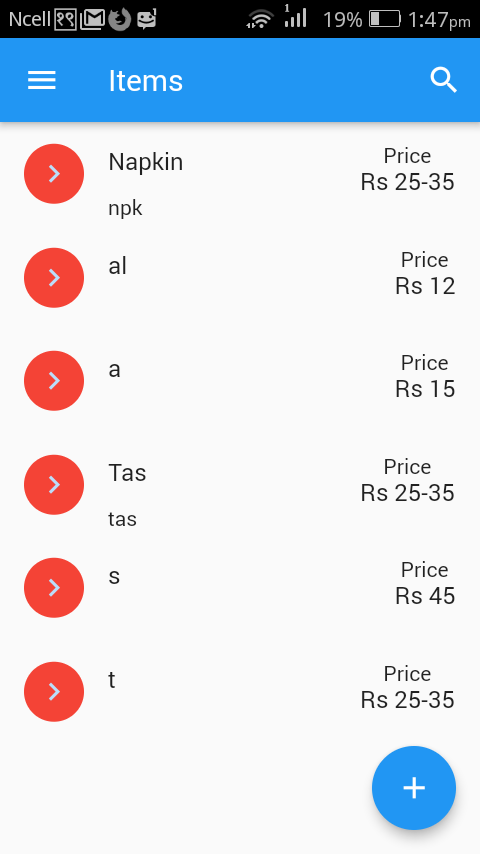 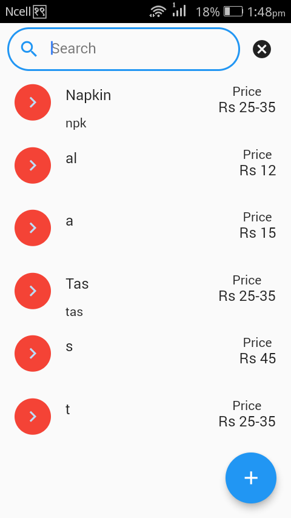 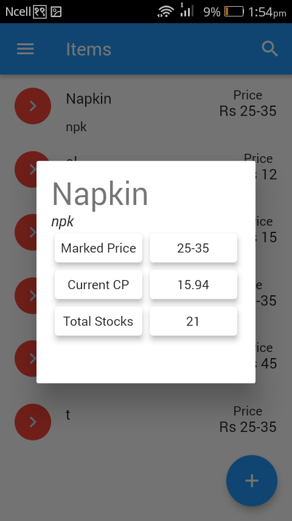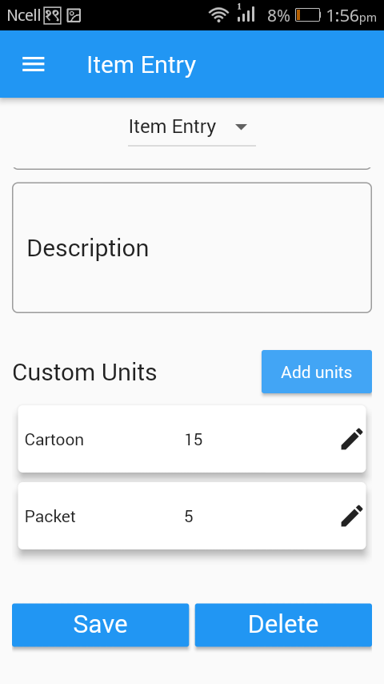
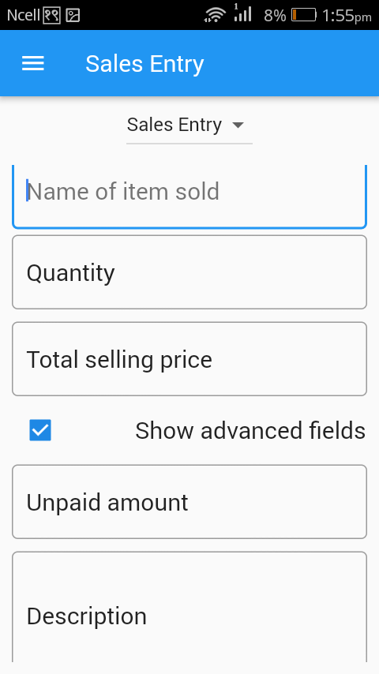 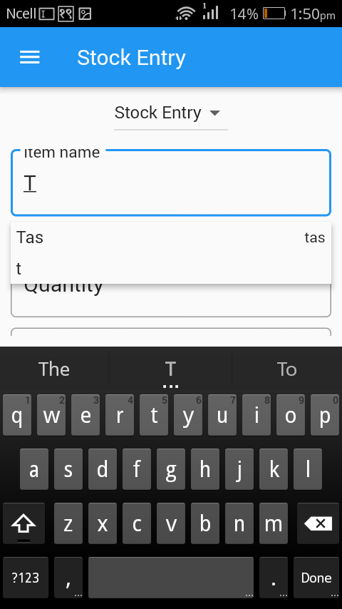 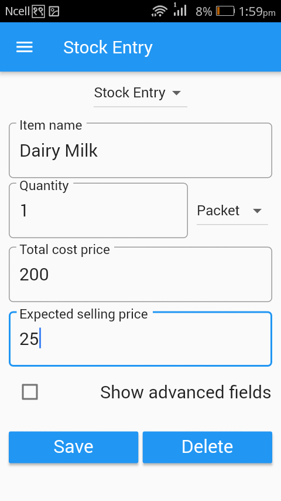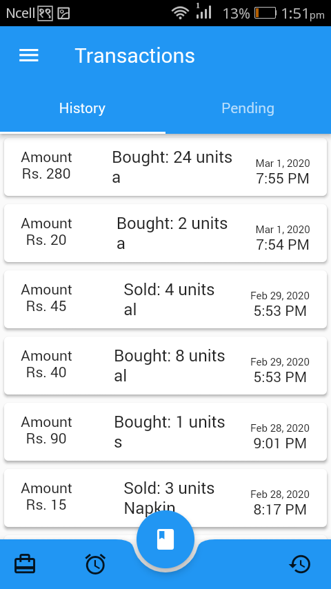
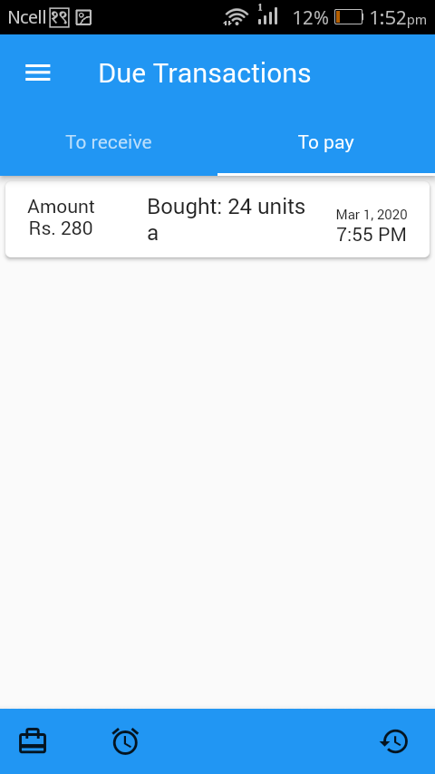 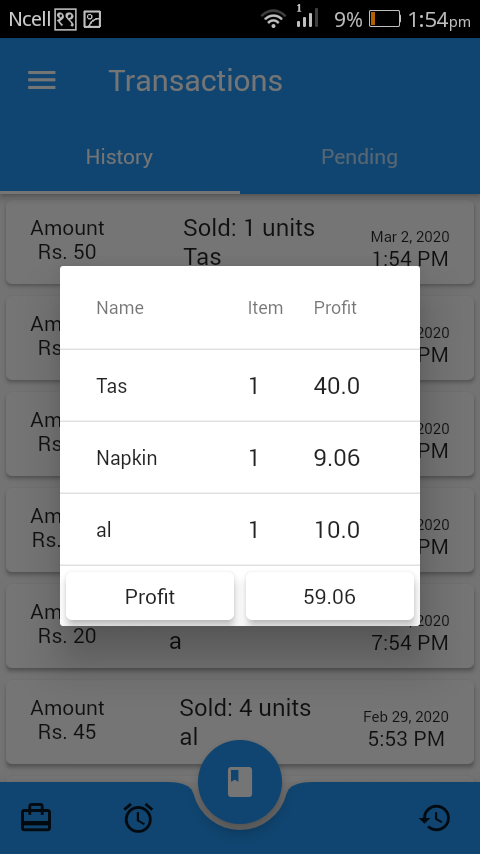 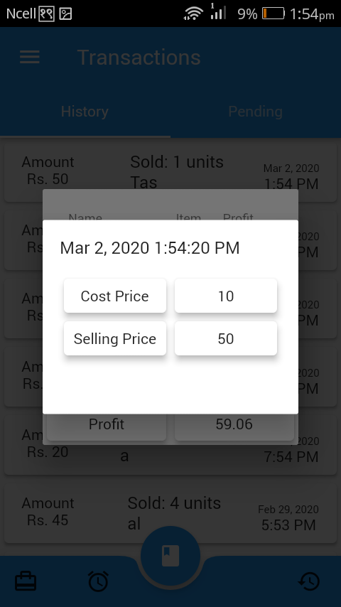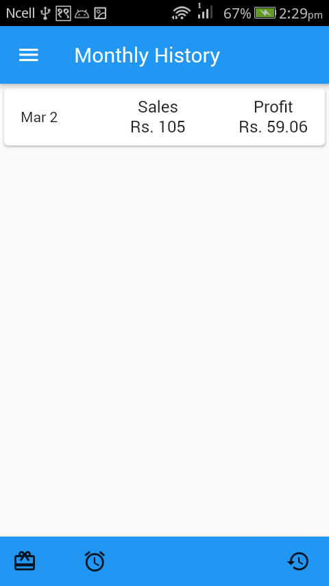
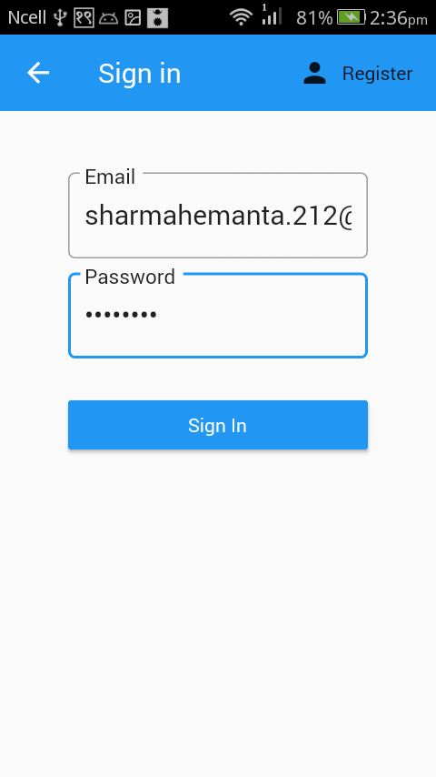 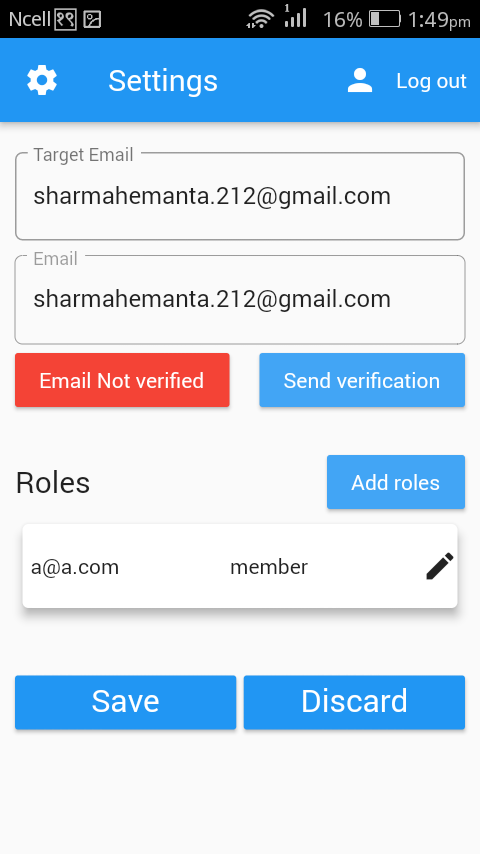 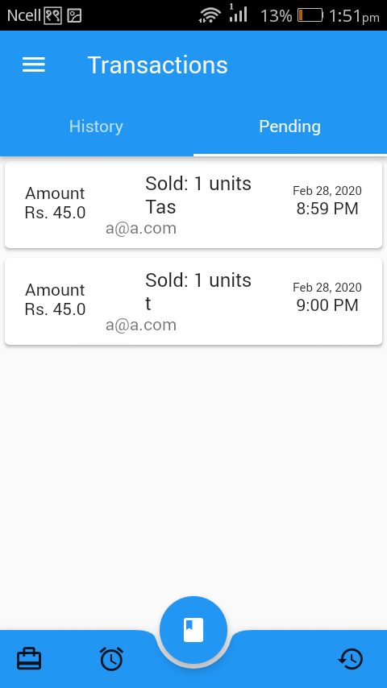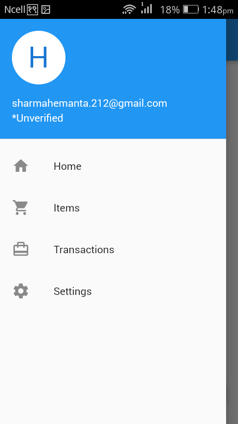


## Project Installation:

### 1. Install and try out the apk!
Head over to the release page to try out the apps. [APK Releases](https://github.com/hemanta212/inventory_app/releases/latest)

### 2. Building yourself

#### 1. Get Flutter
* Install flutter : [Flutter Installation](https://flutter.dev/docs/get-started/install)

#### 2. Clone this repo
```
$ git clone https://github.com/hemanta212/inventory_app.git
$ cd inventory_app
```

#### 3. Setup the firebase app

1. You'll need to create a Firebase instance. Follow the instructions at https://console.firebase.google.com.
2. Once your Firebase instance is created, you'll need to enable Google authentication.

* Go to the Firebase Console for your new instance.
* Click "Authentication" in the left-hand menu
* Click the "sign-in method" tab
* Click "Google" and enable it

3. Enable the Firebase Database
* Go to the Firebase Console
* Click "Database" in the left-hand menu
* Click the Cloudstore "Create Database" button
* Select "Start in test mode" and "Enable"

4. (skip if not running on Android)
* Create an app within your Firebase instance for Android, with package name com.yourcompany.news
* Run the following command to get your SHA-1 key:

```
keytool -exportcert -list -v \
-alias androiddebugkey -keystore ~/.android/debug.keystore
```

* In the Firebase console, in the settings of your Android app, add your SHA-1 key by clicking "Add Fingerprint".
* Follow instructions to download google-services.json
* place `google-services.json` into `/android/app/`.

#### 4. Run
Connect your device 

```
$ flutter upgrade
$ flutter pub get
$ flutter run
```
